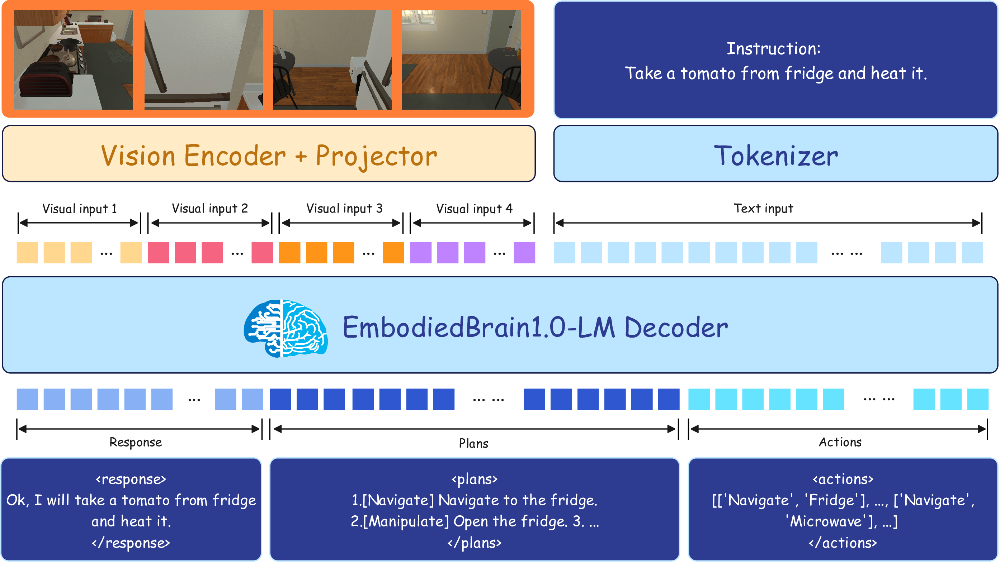

# EmbodiedBrain: Expanding Performance Boundaries of Task Planning for Embodied Intelligence

[[📜 Paper]](https://arxiv.org/pdf/2510.20578) [[⭐️Project Page]](https://zterobot.github.io/EmbodiedBrain.github.io/) [[🤗 Model 7B]](https://huggingface.co/ZTE-AIM/EmbodiedBrain-7B) [[🤗 Model 32B]](https://huggingface.co/ZTE-AIM/EmbodiedBrain-32B)

<p align="center">

</p>

<!-- [[📝 Chinese Post]](https://mp.weixin.qq.com/s/FmjG0Gp5ow7mm2Vzd9ppPg) -->

# Introduction

Current models for embodied AI face challenges in agent alignment, real-time performance, and authentic evaluation. To address this, we propose ​**EmbodiedBrain 1.0**​, a novel 7B and 32B vision-language foundation model that achieves state-of-the-art performance.

This repository provides the modular framework for training and evaluating our model. It is a comprehensive toolkit for embodied intelligence models, supporting both large-scale Supervised Fine-Tuning (SFT) and Reinforcement Learning (RL).

Key features of our framework include:

* An agent-aligned data structure.
* A powerful RL training methodology, ​**Step-Augmented Group Relative Policy Optimization (Step-GRPO)**.
* A comprehensive and flexible reward system (e.g., a Generative Reward Model) with support for custom plugins.
* A three-part evaluation benchmark, including a novel simulation environment, to ensure robust validation.

We will open-source all of our data, model weights, and evaluation methods to advance research in generalist embodied agents.

---

## 📁 Project Structure

Here is the core directory structure of this project:

```
EmbodiedBrain1.0/
├── data/
│   └── ...           (Coming Soon: Datasets will be released here)
│
├── evaluation/
│   └── ...           (Contains model evaluation scripts)
│
├── examples/
│   └── ...           (Contains partial examples of data construction)
│
└── train/
    ├── SFT/
    │   └── ...         (SFT training scripts based on LlamaFactory)
    │
    └── RL/
        └── ms-swift-main/
            ├── main_experiments/
            │   ├── plugin/
            │   │   └── ...     (Custom reward functions adapted for the SWIFT framework)
            │   │
            │   └── train_bash/
            │       └── train_rl.sh (RL training entry script)
            │
            └── ... (Other files for the SWIFT framework)
```

## 🚀 Quick Start

### 1. Setup

First, clone this repository to your local machine:

```
git clone [https://github.com/](https://github.com/)[Your-Username]/EmbodiedBrain1.0.git
cd EmbodiedBrain1.0
```

This project depends on the `LlamaFactory` and `SWIFT` frameworks. Please install the required dependencies according to their official documentation:

1. **Install LlamaFactory (for SFT):** Please refer to the [LlamaFactory Official Documentation](https://github.com/hiyouga/LLaMA-Factory "null") for environment setup.
2. **Install SWIFT (for RL):** Please refer to the [SWIFT Official Documentation](https://github.com/modelscope/swift "null") for environment setup.

### 2. SFT Training

SFT training scripts are located in the `train/SFT/` directory.

```
cd train/SFT
# Run the LlamaFactory training command
# (Please modify according to LlamaFactory usage and the scripts you prepared in the SFT directory)
bash train_sft.sh
```

### 3. RL Training

RL training scripts are located in `train/RL/ms-swift-main/main_experiments/train_bash/`.

The `ms-swift-main/main_experiments/plugin/` directory contains custom reward functions adapted for the SWIFT framework, which you can call in your training configuration.

```
# Enter the RL training script directory
cd train/RL/ms-swift-main/main_experiments/train_bash
# Start RL training
bash train_rl.sh
```

### 4. Evaluation

Evaluation scripts are located in the `evaluation/` directory.


## 🙏 Acknowledgements

The development of this project relies on the following excellent open-source frameworks:

* [LlamaFactory](https://github.com/hiyouga/LLaMA-Factory "null")
* [ModelScope SWIFT](https://github.com/modelscope/swift "null")

## 📄 License

This project is released under the [MIT License](LICENSE).

## Star History

[](https://www.star-history.com/?spm=a2ty_o01.29997173.0.0.6db4c921pHzlTe#ZTERobot/EmbodiedBrain1.0&type=date&legend=top-left)


## 🖊️ Citation

If you find this work helpful in your research, please consider giving this repo a star ⭐ and citing our paper:
```
@article{zou2025embodiedbrain,
  title={EmbodiedBrain: Expanding Performance Boundaries of Task Planning for Embodied Intelligence},
  author={Zou, Ding and Wang, Feifan and Ge, Mengyu and Fan, Siyuan and Zhang, Zongbing and Chen, Wei and Wang, Lingfeng and Hu, Zhongyou and Yan, Wenrui and Gao, Zhengwei and Wang, Hao and Jin, Weizhao and Zhang Yu and Zhao, Hainan and Zhang, Mingliang and Xi, Xianxian and Zhang, Yaru and Li, Wenyuan and Wu, Yunpeng and Gao, Zhengguang and Zhu Yurui},
  journal={arXiv preprint arXiv:2510.20578},
  year={2025}
}
```


